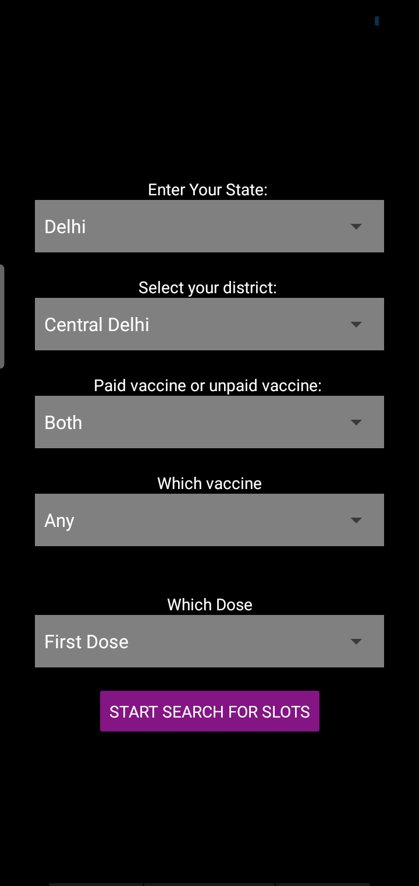
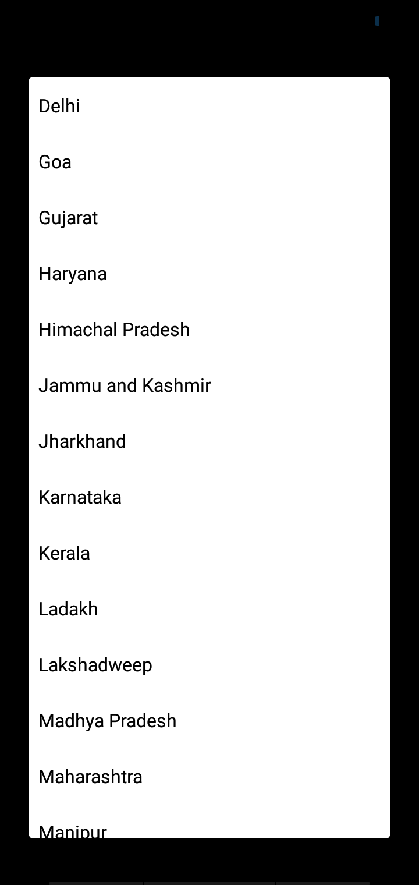
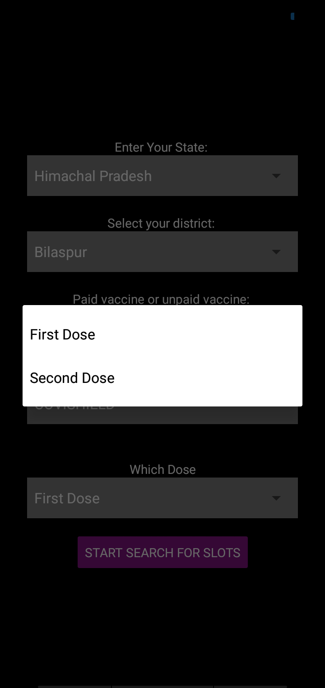

# **cowinSlot**

This is an app that uses the cowin api to notify users when their preferred vaccination slot is available.  
The app is built with react native.

## GUI of the app

 

 
 

 The user friendly gui allows users to bypass the challenges of understanding the API and use their own mobile device to fetch from the cowin api.
  
 Instead of relying on third party servers to fetch from the API and inform them, the users have the control in their own hands making this method the fastest.
  
 With an API call every 4 seconds, it notifies users instantly providing them theoretically the fastest and the easiest way to search for a vaccination slot.

